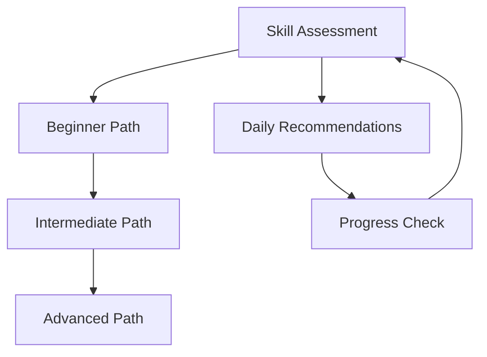

## Overview

Mott provides a comprehensive suite of tools designed specifically for learning the Chechen language. You access interactive resources that combine modern technology with cultural depth, helping you build fluency while understanding Chechen heritage. From video lessons to community forums, every feature supports your journey toward proficiency.

<Callout kind="tip">
  Start with a skill assessment to unlock personalized recommendations tailored to your current level.
</Callout>

## Key Features at a Glance

Discover the core capabilities through these highlighted tools. Each feature integrates seamlessly to create an engaging learning experience.

<Columns cols={2}>
  <Card title="Interactive Video Lessons" icon="video" href="#interactive-lessons">
    Watch native speakers deliver lessons with synchronized audio pronunciations and subtitles.
  </Card>
  <Card title="Practice Exercises & Quizzes" icon="check-circle" href="#practice-exercises">
    Test your knowledge with adaptive quizzes and track progress over time.
  </Card>
  <Card title="Community Forums" icon="users" href="#community-discussions">
    Join discussions and exchange cultural insights with fellow learners.
  </Card>
  <Card title="Personalized Paths" icon="map" href="#personalized-paths">
    Receive custom learning plans based on your skill assessments.
  </Card>
</Columns>

## Interactive Video Lessons and Audio Pronunciations

Dive into lessons featuring high-quality videos from native Chechen speakers. Each video includes clickable audio pronunciations, slow-motion playback, and interactive transcripts.

### How to Get Started

<Steps>
  <Step title="Sign In" icon="log-in">
    Visit `https://app.mott.com` and log in with your account.
  </Step>
  <Step title="Browse Lessons" icon="book-open">
    Navigate to the Lessons section and select a topic like basic greetings.
  </Step>
  <Step title="Engage with Content" icon="play-circle">
    Play the video, hover over words for pronunciations, and repeat phrases using the built-in recorder.
  </Step>
</Steps>

<Tabs>
  <Tab title="Beginner" icon="star">
    Focus on foundational vocabulary and simple sentences.
  </Tab>
  <Tab title="Intermediate" icon="trending-up">
    Explore grammar structures and conversational practice.
  </Tab>
  <Tab title="Advanced" icon="zap">
    Delve into idioms, literature, and cultural nuances.
  </Tab>
</Tabs>

## Practice Exercises, Quizzes, and Progress Tracking

Reinforce your learning with hands-on exercises. Quizzes adapt to your performance, and detailed analytics show your strengths and areas for improvement.

| Feature | Description | Benefit |
|---------|-------------|---------|
| Flashcards | Spaced repetition for vocabulary | Long-term retention |
| Quizzes | Multiple-choice and fill-in-the-blank | Immediate feedback |
| Progress Dashboard | Charts and stats | Motivation through visible growth |

<Expandable title="View Sample Progress Data" default-open="false">
  Your dashboard displays metrics like words learned (`>500`), quiz accuracy (`92%`), and streak days (`14`).
</Expandable>

## Community Discussions and Cultural Exchange

Connect with a global community passionate about Chechen culture. Participate in forums to ask questions, share experiences, and collaborate on projects.

<Callout kind="info">
  Follow community guidelines to ensure respectful exchanges focused on language and culture.
</Callout>

## Personalized Learning Paths

Mott analyzes your quiz results and lesson completions to generate custom paths. You receive daily recommendations that adapt as you progress.

### Customizing Your Path

<Steps>
  <Step title="Take Assessment" icon="clipboard-list">
    Complete the initial quiz at `https://app.mott.com/assess`.
  </Step>
  <Step title="Review Path" icon="eye">
    Check your dashboard for suggested lessons.
  </Step>
  <Step title="Adjust Preferences" icon="settings">
    Edit goals like daily time commitment or focus areas.
  </Step>
</Steps>

These features work together to provide a holistic learning experience. Explore them today to accelerate your Chechen proficiency.